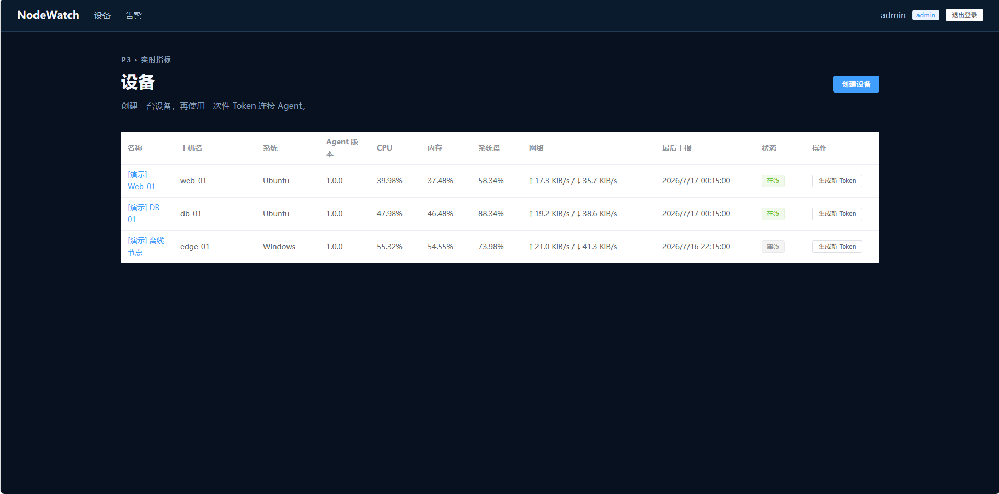
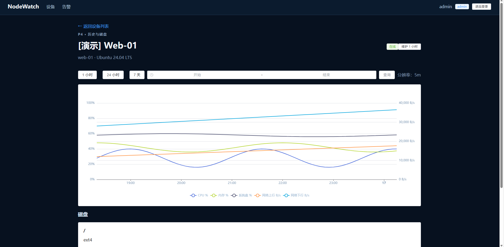
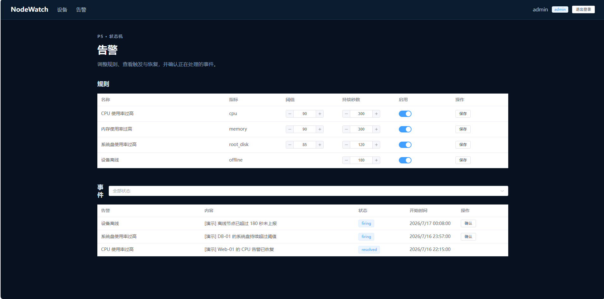
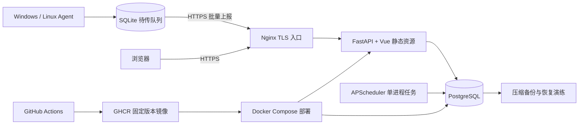

# NodeWatch

NodeWatch 是一个面向个人学习、作品展示和小规模自托管场景的跨平台主机监控系统。它由 Vue 管理界面、FastAPI 服务端、PostgreSQL 数据库和 Windows/Linux Agent 组成，能够展示主机实时状态、历史指标、磁盘信息与告警事件。

当前版本：`v1.0.0`（发布候选）<br>
目标规模：10～50 台设备，每台默认 60 秒上报一次<br>
许可证：[MIT](LICENSE)

## 功能

- 管理员登录、Session 会话、`admin/viewer` 后端权限控制
- 设备管理和只显示一次的独立 Agent Token
- CPU、内存、系统盘、网络速率、运行时间和多磁盘采集
- latest 快照、原始历史、5 分钟/1 小时数据库聚合和 ECharts 曲线
- CPU、内存、磁盘和离线告警，支持持续时间、恢复、确认与维护模式
- Agent SQLite WAL 离线队列、幂等批量补传、指数退避和日志轮转
- Windows 计划任务与 Linux systemd 安装，独立可执行文件无需目标机安装 Python
- Docker Compose、Nginx HTTPS、GitHub Actions、GHCR、备份恢复和版本回滚

## 界面预览

### 设备总览



### 历史指标与磁盘



### 告警规则与事件



截图使用独立演示数据库生成，只包含 `[演示]` 设备。脱敏与重拍规则见 [docs/screenshots/README.md](docs/screenshots/README.md)。

## 架构



完整说明见 [docs/ARCHITECTURE.md](docs/ARCHITECTURE.md)，可复用的 Mermaid 源文件见 [docs/architecture.mmd](docs/architecture.mmd)。

## 技术栈

- 前端：Vue 3、TypeScript、Pinia、Vue Router、Element Plus、ECharts
- 后端：Python 3.12、FastAPI、SQLAlchemy、Alembic、APScheduler
- 数据：PostgreSQL 17、Agent 本地 SQLite WAL
- 工程：Docker Compose、Nginx、PyInstaller、GitHub Actions、GHCR

## 本地快速开始（Windows PowerShell）

准备 Python 3.12、Node.js 22、Git 和已经启动的 Docker Desktop。

### 1. 启动 PostgreSQL

```powershell
cd "D:\你的目录\nodewatch"
docker compose -f deploy/docker-compose.local.yml up -d
Copy-Item .env.example .env
```

编辑 `.env`，至少替换 `SECRET_KEY` 和 `BOOTSTRAP_ADMIN_PASSWORD`。如果 `.env` 已存在，不要再次复制覆盖。

### 2. 启动后端

```powershell
cd backend
py -3.12 -m venv .venv
Set-ExecutionPolicy -Scope Process -ExecutionPolicy RemoteSigned
.\.venv\Scripts\Activate.ps1
python -m pip install -e ".[dev]"
alembic upgrade head
python -m uvicorn app.main:app --reload
```

就绪检查：<http://127.0.0.1:8000/api/v1/health/ready>

### 3. 启动前端

保留后端窗口，再打开一个 PowerShell：

```powershell
cd frontend
npm.cmd ci
npm.cmd run dev
```

访问终端显示的地址（通常是 <http://localhost:5173>），使用 `.env` 中的首次管理员账号登录。管理员只在用户表为空时创建；以后修改 `.env` 不会覆盖数据库中的密码。

### 4. 可选：生成安全的演示数据

演示命令只重建固定 UUID、带 `[演示]` 前缀的三台设备，不会删除真实设备；检测到 `APP_ENV=production` 时会直接拒绝执行。

```powershell
cd backend
$env:APP_ENV="demo"
.\.venv\Scripts\python.exe -m app.cli seed-demo --confirm
Remove-Item Env:APP_ENV
```

执行后刷新网页，可看到在线设备、离线设备、历史曲线和告警事件。重复执行结果仍然可控，不会不断追加演示设备。

## 连接 Agent

1. 登录网页，在“设备”页创建设备并立即保存只显示一次的 Token。
2. 下载 GitHub Actions 构建的系统对应安装包并校验 SHA-256。
3. 按 [docs/AGENT_INSTALL.md](docs/AGENT_INSTALL.md) 安装 Windows 计划任务或 Linux systemd 服务。

不要把完整 Token 写进命令截图、仓库、聊天记录或公开文档。

## 自动化验证

```powershell
cd backend
.\.venv\Scripts\python.exe -m ruff check . --no-cache
.\.venv\Scripts\python.exe -m pytest -q -p no:cacheprovider

cd ..\agent
.\.venv\Scripts\python.exe -m ruff check . --no-cache
.\.venv\Scripts\python.exe -m pytest -q -p no:cacheprovider

cd ..\frontend
npm.cmd run typecheck
npm.cmd run test
npm.cmd run build
```

推送和 Pull Request 还会触发 GitHub Actions，对后端、前端、Agent 和跨平台 Agent 安装包执行相同检查。

## 生产部署

生产镜像将 Vue 产物与 FastAPI 合并为同源服务。App 只映射到宿主机 `127.0.0.1:8000`，PostgreSQL 不发布宿主机端口，公网仅由 Nginx 提供 80/443。完整步骤见 [docs/ALIYUN_DEPLOY.md](docs/ALIYUN_DEPLOY.md)。

运维脚本位于 `deploy/scripts`：

- `deploy.sh`：固定镜像版本部署并执行冒烟检查
- `backup.sh`：生成权限为 `600` 的压缩逻辑备份
- `restore-test.sh`：恢复到临时数据库并验证表结构
- `rollback.sh`：回滚到指定 App 镜像，数据库不重建

## 安全与数据保留

- 密码使用 Argon2；Session 和 Agent Token 在数据库只保存 SHA-256 哈希。
- 生产 Cookie 仅通过 HTTPS 发送，Nginx 是唯一公网 Web 入口。
- 原始指标默认保留 30 天；Agent 缓存默认保留 7 天、最多 10000 条。
- 示例配置只放占位值，真实 `.env`、Token、私钥、数据库和备份文件都被 Git 忽略。
- 公开仓库前按 [docs/SECURITY.md](docs/SECURITY.md) 执行秘密扫描清单。

## 已知限制

- 调度器在应用进程内运行，因此生产固定单 App 副本和单 Uvicorn Worker。
- 当前是单机架构，没有高可用、分布式锁、消息队列或独立对象存储。
- 2 核 2 GiB 适合个人项目与 10～50 台、60 秒采样的目标规模，不代表更大规模性能承诺。
- 告警目前只在网页展示，不包含短信、邮件或即时通讯通知。
- 项目不提供远程命令、桌面控制、截屏、键盘记录或完整进程采集。

## 文档导航

- [架构说明](docs/ARCHITECTURE.md)
- [API 说明](docs/API.md)
- [Agent 安装](docs/AGENT_INSTALL.md)
- [阿里云部署](docs/ALIYUN_DEPLOY.md)
- [安全设计](docs/SECURITY.md)
- [故障排查](docs/TROUBLESHOOTING.md)
- [简历与面试提纲](docs/RESUME_AND_INTERVIEW.md)
- [v1.0.0 发布清单](docs/RELEASE_CHECKLIST.md)
- [技术决策](DECISIONS.md)
- [开发进度](PROGRESS.md)

## License

[MIT License](LICENSE)
