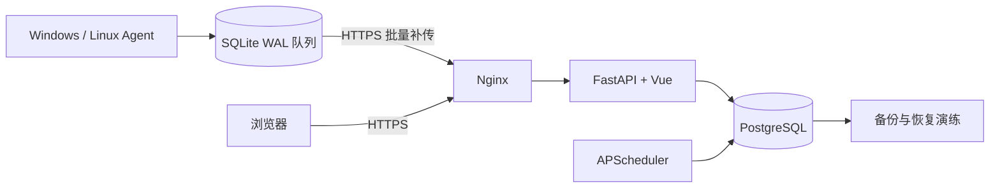

# 架构说明

NodeWatch 面向 10～50 台设备、60 秒采样的小规模自托管场景。设计目标是在 2 核 2 GiB 单机上保持结构清晰、可靠且便于初学者理解，而不是追求分布式高可用。

## 系统边界

独立 Mermaid 源文件：[architecture.mmd](architecture.mmd)。

## 请求链路

浏览器使用服务端 Session：登录成功后，随机 Session Token 写入 HttpOnly Cookie，数据库只保存哈希。Vue 路由守卫请求 `/api/v1/auth/me` 判断登录状态；`admin/viewer` 权限始终由后端校验。

Agent 使用每台设备独立的 Bearer Token。首次运行生成随机实例 UUID，bootstrap 后 Token 与该实例绑定；复制同一 Token 到另一实例会得到 409。Token 被撤销或设备禁用后返回 403。

## 指标数据流

1. Agent 每个周期采集 CPU、内存、磁盘、网络和 uptime。
2. 样本先事务写入本地 SQLite WAL，异常退出或断网不会直接丢失待确认数据。
3. Agent 按采集时间批量上报；网络和 5xx 使用带抖动的指数退避。
4. 服务端以“设备 + 采集时间”保证幂等，同时写历史表并按时间 upsert latest 表。
5. 设备列表查询 latest 表；历史接口使用 PostgreSQL `date_bin` 生成 5 分钟或 1 小时桶，最多返回 1500 点。

latest 表是一个有意的读模型：总览无需每次扫描不断增长的历史表，旧的离线补传样本也不能覆盖更晚的实时状态。

## 告警状态机

实时 CPU、内存和系统盘规则在写入指标的事务中评估；离线规则由 APScheduler 定时检查。告警经过“持续超过阈值 → firing → acknowledged（可选）→ resolved”，partial unique index 防止同一设备同一规则出现多个未恢复事件。维护模式与禁用设备不触发离线告警。

## 生产拓扑

- GitHub Actions 测试后构建固定 tag 的 App 和 PostgreSQL 镜像并推送 GHCR。
- App 镜像用多阶段构建合并 Vue 静态资源和 FastAPI，最终进程使用非 root 用户。
- Compose 固定单 App 副本、单 Uvicorn Worker；进程内调度器暂不支持横向扩容。
- App 只映射 `127.0.0.1:8000`，PostgreSQL 只存在于 Compose 内部网络。
- Nginx 是唯一公网 Web 入口，负责 HTTP 跳转、TLS 和代理头。
- 命名卷负责容器重建后的数据持久化，`pg_dump` 负责逻辑备份，云盘快照覆盖整盘故障。

## 演示数据隔离

`python -m app.cli seed-demo --confirm` 只操作三个固定 UUID、带 `[演示]` 前缀的设备。若固定 UUID 已被其他名称占用则中止；`APP_ENV=production` 时命令拒绝运行。这样既能生成可截图的曲线和告警，也不会把演示数据静默混入生产环境。

## 主要取舍

- PostgreSQL Session 替代 Redis：降低单机资源和运维成本，但超大规模会话需要重新评估。
- 进程内 APScheduler：结构简单，但要求单副本；扩容时应改为独立调度器或分布式锁。
- PostgreSQL 原生时间桶：无需额外时序数据库，适合当前规模；更高写入量需压测后再考虑分区或专用时序方案。
- SQLite Agent 队列：跨平台、零额外服务；缓存有 7 天和 10000 条上限，极长断网会按策略清理旧样本。

详细设计动机见项目根目录的 [DECISIONS.md](../DECISIONS.md)。
